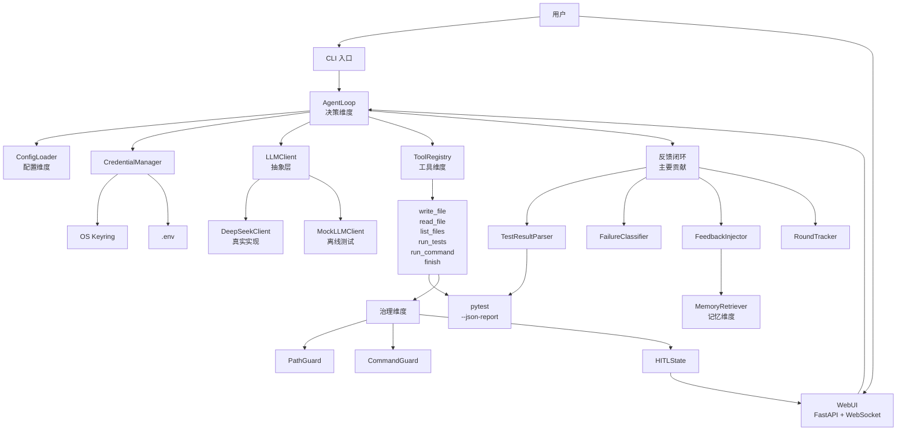
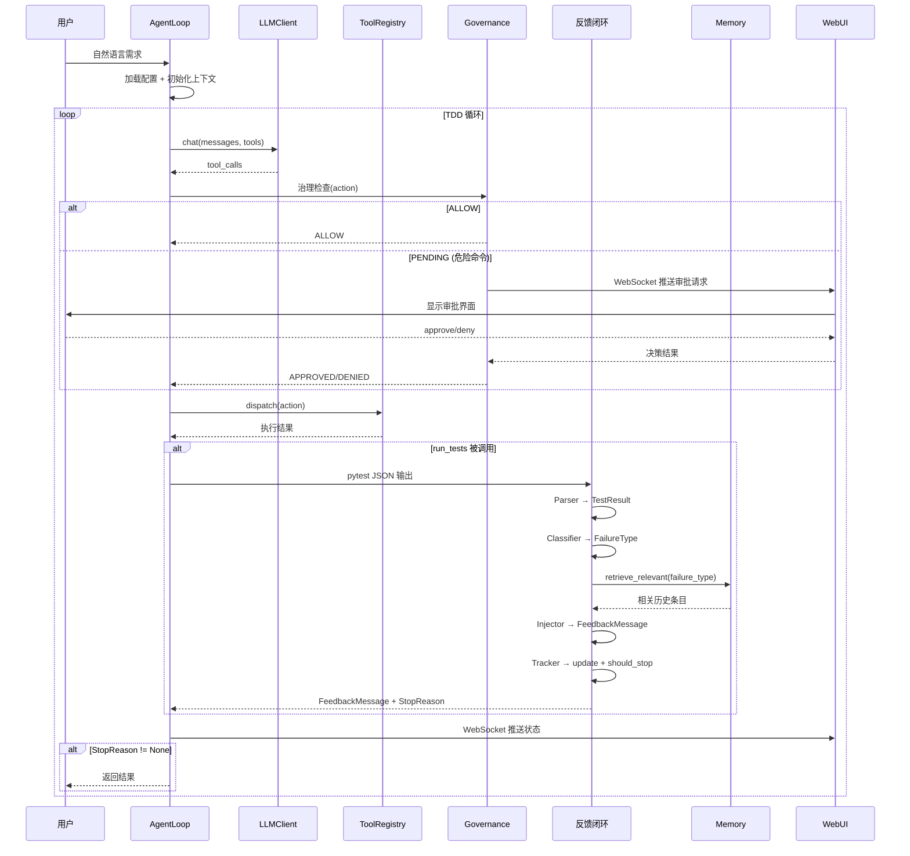
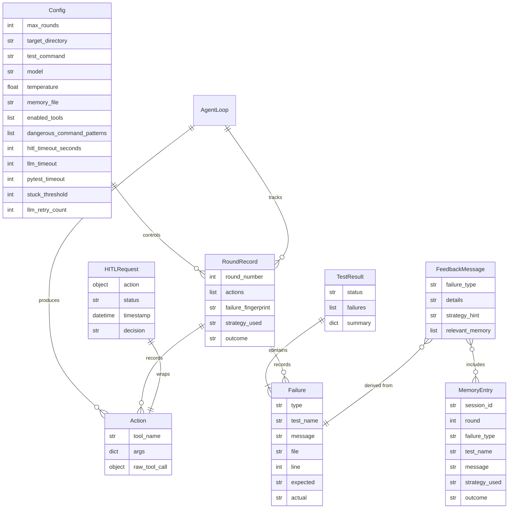

# SPEC.md — Coding Agent Harness 设计文档

> *Spec-Driven, Subagent-Built, Human-Owned.*
>
> 本文档由 Superpowers `brainstorming` 技能驱动、经 12 轮迭代设计、由学生本人批准。
> 过程记录见 `SPEC_PROCESS.md`。

---

## 1. 问题陈述

### 1.1 要解决什么问题

当 LLM 能完成大部分编码工作时，工程师的真正价值落在 harness 这层工程——治理、反馈、上下文、安全、分发。本项目构建一个 **TDD 专项 Coding Agent Harness**：接收自然语言需求，自主走"写失败测试 → 跑测试（红） → 写最少实现 → 跑测试（绿） → 重构 → 重复"循环，直到全绿或停机。

核心命题：**移除 LLM 这一不确定因素后，仓库里还剩多少可独立验证的工程？** 本项目的回答是：agent 主循环、工具分发、反馈闭环（失败分类 + 策略路由 + 卡死检测 + 停机判断）、治理护栏（路径围栏 + 危险命令检测 + HITL 状态机）、记忆检索、配置强制执行——全部为确定性代码，在 mock LLM 下可逐环节单测。

### 1.2 目标用户

希望自动化测试驱动开发流程的开发者。用户提供需求描述和目标目录，harness 在目录内自主创建测试与实现文件，通过测试反馈驱动自我修正。

### 1.3 为什么值得做

1. 减少手动编写测试和实现的重复劳动；
2. agent 在测试失败的**确定性反馈**驱动下自我修正，而非依赖 LLM 的"智能"猜测——这恰好是要求2 A.4-B"机制必须是代码不是提示词"的最佳示范；
3. "用一个 harness（Superpowers）去造另一个 harness"——对 agentic SE 方法论形成第一手批判性理解。

---

## 2. 用户故事

遵循 INVEST 原则（Independent / Negotiable / Valuable / Estimable / Small / Testable）。

| ID | 用户故事 | INVEST 检查 |
|---|---|---|
| US1 | 作为开发者，我希望提供自然语言需求并让 harness 自动走 TDD 循环（红→绿→重构），以便我专注于需求而非样板代码。 | I: 独立于其他故事 / N: 循环轮次可调 / V: 减少重复劳动 / E: 可估算 / S: 一个 task 可完成 / T: 验证 agent 走完红→绿 |
| US2 | 作为开发者，我希望 harness 自动运行测试并将失败分类反馈给 agent，以便 agent 无需我的干预即可自我修正。 | I: 独立 / N: 分类粒度可调 / V: 自主修正 / E: 可估算 / S: 反馈模块 / T: 验证 6 类分类正确 |
| US3 | 作为开发者，我希望 harness 拦截危险命令并请求我的审批，以便我的系统不被自主操作损坏。 | I: 独立 / N: 危险模式可配置 / V: 安全保障 / E: 可估算 / S: 治理模块 / T: 验证 rm -rf 被拦截 |
| US4 | 作为开发者，我希望通过 WebUI 实时查看 agent 的 TDD 进度（轮次、测试结果、失败分类），以便我监控并在需要时干预。 | I: 独立 / N: 前端可调 / V: 可观测 / E: 可估算 / S: WebUI task / T: 验证 WebSocket 推送 |
| US5 | 作为开发者，我希望通过 YAML 配置文件自定义 harness 行为（最大轮次、目标目录、危险命令模式），以便适配不同项目。 | I: 独立 / N: 配置项可增减 / V: 可定制 / E: 可估算 / S: 配置模块 / T: 验证配置由代码强制执行 |
| US6 | 作为开发者，我希望 harness 跨会话记住失败模式与成功策略，以便对类似失败应用已验证的策略。 | I: 独立 / N: 记忆结构可调 / V: 跨会话学习 / E: 可估算 / S: 记忆模块 / T: 验证按类型过滤检索 |

---

## 3. 功能规约

按模块拆分，每项描述输入 / 行为 / 输出 / 边界条件 / 错误处理。

### 3.1 Agent 主循环（决策维度）

| 项 | 描述 |
|---|---|
| **输入** | 自然语言需求字符串 + `harness.yaml` 配置 |
| **行为** | 加载配置 → 初始化上下文 → 循环（组织上下文 → 调用 LLM → 解析 tool_calls → 治理检查 → 分发执行 → 反馈回灌 → 轮次追踪 → 停机判断）→ 返回结果 |
| **输出** | 测试状态（pass/fail）、轮次记录列表、目标目录内产物文件 |
| **边界** | 最大轮次由 `max_rounds` 配置；目标目录由 `target_directory` 配置；LLM 超时由配置控制 |
| **错误处理** | LLM 调用失败 → 重试 N 次后报错停机；工具执行异常 → 捕获并回灌错误信息；治理拦截 → HITL 或直接拒绝 |

### 3.2 工具集（工具维度）

#### 3.2.1 `write_file(path: str, content: str)`

| 项 | 描述 |
|---|---|
| **输入** | 相对路径 + 文件内容 |
| **行为** | 将内容写入目标目录内指定路径 |
| **输出** | `{"success": true}` 或 `{"success": false, "error": "..."}` |
| **边界** | 路径必须在 `target_directory` 内 |
| **错误处理** | 路径越界 → PathGuard 拦截返回 DENY；权限不足 → 返回错误；目录不存在 → 自动创建 |

#### 3.2.2 `read_file(path: str)`

| 项 | 描述 |
|---|---|
| **输入** | 相对路径 |
| **行为** | 读取目标目录内文件内容 |
| **输出** | `{"content": "..."}` 或 `{"error": "..."}` |
| **边界** | 路径必须在 `target_directory` 内 |
| **错误处理** | 路径越界 → 拦截；文件不存在 → 返回错误 |

#### 3.2.3 `list_files(path: str)`

| 项 | 描述 |
|---|---|
| **输入** | 相对路径 |
| **行为** | 列出目标目录内指定路径下的文件和子目录 |
| **输出** | `{"files": [...], "dirs": [...]}` |
| **边界** | 路径必须在 `target_directory` 内 |
| **错误处理** | 路径越界 → 拦截；路径不存在 → 返回空列表 |

#### 3.2.4 `run_tests()`

| 项 | 描述 |
|---|---|
| **输入** | 无（使用 `test_command` 配置） |
| **行为** | 运行 `pytest --json-report --output=.harness/report.json`，解析 JSON 输出 |
| **输出** | `TestResult` 对象（status, failures[], summary） |
| **边界** | 测试必须在 `target_directory` 内运行 |
| **错误处理** | pytest 崩溃 → 返回 COLLECTION 错误；超时 → 返回 TIMEOUT；JSON 解析失败 → 返回 RUNTIME 错误 |

#### 3.2.5 `run_command(cmd: str)`

| 项 | 描述 |
|---|---|
| **输入** | shell 命令字符串 |
| **行为** | 经 CommandGuard 检查 → ALLOW 直接执行 / PENDING 进入 HITL 审批 → 执行 |
| **输出** | `{"stdout": "...", "stderr": "...", "exit_code": N}` |
| **边界** | 危险命令需 HITL 审批；HITL 超时默认拒绝 |
| **错误处理** | 命令匹配危险模式 → PENDING；HITL 拒绝 → 返回拒绝反馈；执行失败 → 返回 exit_code 和 stderr |

#### 3.2.6 `finish(reason: str)`

| 项 | 描述 |
|---|---|
| **输入** | 完成原因字符串 |
| **行为** | 信号 agent 循环停止 |
| **输出** | 停机信号 |
| **边界** | 无 |
| **错误处理** | 无 |

### 3.3 反馈闭环（反馈维度 — 主要贡献）

#### 3.3.1 TestResultParser

| 项 | 描述 |
|---|---|
| **输入** | pytest `--json-report` 输出的 JSON 字符串 |
| **行为** | 解析 JSON → 提取测试状态、失败详情（测试名、消息、文件、行号、期望/实际值）→ 构造 `TestResult` |
| **输出** | `TestResult{status, failures: List[Failure], summary}` |
| **边界** | 仅解析 pytest JSON 格式；非 pytest 格式返回错误 |
| **错误处理** | JSON 解析失败 → 返回 `TestResult(status=ERROR, failures=[{type=COLLECTION}])`；字段缺失 → 用默认值填充 |

#### 3.3.2 FailureClassifier

| 项 | 描述 |
|---|---|
| **输入** | 单个 `Failure` 对象（含 message, traceback） |
| **行为** | 根据消息和 traceback 模式匹配，分类为 6 种失败类型之一 |
| **输出** | `FailureType` 枚举值 |
| **边界** | 6 种类型：ASSERTION / SYNTAX / IMPORT / RUNTIME / TIMEOUT / COLLECTION |
| **错误处理** | 无法匹配任何模式 → 默认 RUNTIME |

分类规则：

| FailureType | 匹配模式 |
|---|---|
| ASSERTION | 消息含 "AssertionError" 或 "assert" |
| SYNTAX | 消息含 "SyntaxError" 或 "IndentationError" |
| IMPORT | 消息含 "ModuleNotFoundError" 或 "ImportError" |
| RUNTIME | 消息含 "TypeError" / "ValueError" / "KeyError" / "AttributeError" 等 |
| TIMEOUT | pytest 报告超时或进程超时 |
| COLLECTION | pytest 收集阶段失败（无测试被收集） |

#### 3.3.3 FeedbackInjector

| 项 | 描述 |
|---|---|
| **输入** | `TestResult` + `FailureType` + `MemoryRetriever` |
| **行为** | 按失败类型查策略路由表 → 格式化结构化反馈消息 → 检索相关历史记忆 → 组装 `FeedbackMessage` |
| **输出** | `FeedbackMessage{failure_type, details, strategy_hint, relevant_memory}` |
| **边界** | 反馈消息长度限制（避免上下文爆炸） |
| **错误处理** | 记忆检索失败 → 返回空列表，不影响反馈 |

#### 3.3.4 RoundTracker

| 项 | 描述 |
|---|---|
| **输入** | 每轮的 `RoundRecord`（轮次号、动作列表、失败指纹、使用策略、结果） |
| **行为** | 追加到历史 → 更新失败指纹队列 → 检测卡死（同一指纹连续 N 轮）→ 判断停机 |
| **输出** | `StopReason` 或 None（继续） |
| **边界** | `max_rounds` 由配置控制；卡死阈值默认 3 轮 |
| **错误处理** | 无（纯状态机） |

停机判断逻辑：

```
should_stop() -> Optional[StopReason]:
    if all_tests_pass: return PASS
    if round_number >= max_rounds: return MAX_ROUNDS
    if detect_loop(): return STUCK
    if hitl_denied: return HITL_DENIED
    return None  # 继续
```

### 3.4 治理（治理维度）

#### 3.4.1 PathGuard

| 项 | 描述 |
|---|---|
| **输入** | 文件路径 + `target_directory` |
| **行为** | 解析路径为绝对路径 → 检查是否在 target_directory 子树内 → 检查 `..` 穿越 |
| **输出** | `GuardResult.ALLOW` 或 `GuardResult.DENY` |
| **边界** | 仅检查文件操作工具（write_file / read_file / list_files） |
| **错误处理** | 路径解析失败 → DENY |

#### 3.4.2 CommandGuard

| 项 | 描述 |
|---|---|
| **输入** | shell 命令字符串 + `dangerous_command_patterns` |
| **行为** | 逐条正则匹配 → 命中任一 → PENDING；全部不命中 → ALLOW |
| **输出** | `GuardResult.ALLOW` 或 `GuardResult.PENDING` |
| **边界** | 仅检查 `run_command` 工具 |
| **错误处理** | 正则编译失败 → 跳过该条 |

#### 3.4.3 HITLState

| 项 | 描述 |
|---|---|
| **输入** | 待审批的 Action（含命令） |
| **行为** | 进入 PENDING → 等待用户决策（approve/deny/timeout）→ 转换状态 → 返回结果 |
| **输出** | `HITLResult{status: APPROVED/DENIED/TIMEOUT, action}` |
| **边界** | 超时由 `hitl_timeout_seconds` 配置控制 |
| **错误处理** | 超时 → 默认 DENIED |

状态转换：

```
PENDING --user approve--> APPROVED --execute command--> RESUME
PENDING --user deny-----> DENIED --feedback to agent--> RESUME
PENDING --timeout-------> TIMEOUT --feedback to agent--> RESUME
```

### 3.5 记忆（记忆维度）

#### 3.5.1 MemoryRetriever

| 项 | 描述 |
|---|---|
| **输入** | 当前失败类型 + limit（默认 3） |
| **行为** | 读取 `.harness/memory.json` → 按失败类型过滤 `failure_history` → 返回最相关的 N 条 |
| **输出** | `List[MemoryEntry]` |
| **边界** | 仅返回与当前失败类型相同的条目；非全量载入 |
| **错误处理** | 文件不存在 → 返回空列表；JSON 解析失败 → 返回空列表并记录警告 |

#### 3.5.2 MemoryRecorder

| 项 | 描述 |
|---|---|
| **输入** | `RoundRecord`（含失败类型、策略、结果） |
| **行为** | 读取现有 memory.json → 追加新条目 → 写回文件 |
| **输出** | 无（副作用：文件更新） |
| **边界** | 记录失败和成功两种结果 |
| **错误处理** | 文件不存在 → 创建新文件；写入失败 → 记录警告，不影响 agent 运行 |

### 3.6 配置（配置维度）

#### 3.6.1 ConfigLoader

| 项 | 描述 |
|---|---|
| **输入** | `harness.yaml` 文件路径 |
| **行为** | 解析 YAML → 校验必填项 → 构造 `Config` 对象 |
| **输出** | `Config` 对象 |
| **边界** | 缺失字段用默认值填充；未知字段忽略 |
| **错误处理** | YAML 解析失败 → 报错退出；必填项缺失 → 报错退出 |

配置项及其强制执行方式：

| 配置项 | 类型 | 默认值 | 强制执行代码 |
|---|---|---|---|
| `max_rounds` | int | 10 | `RoundTracker.should_stop()` |
| `target_directory` | str | `./workspace` | `PathGuard.check()` |
| `test_command` | str | `pytest --json-report --output=.harness/report.json` | `run_tests` 工具 |
| `model` | str | `deepseek-chat` | `LLMClient` |
| `temperature` | float | 0.1 | `LLMClient` |
| `memory_file` | str | `.harness/memory.json` | `MemoryRetriever` |
| `enabled_tools` | list | 全部 6 个 | `ToolRegistry.dispatch()` 白名单 |
| `dangerous_command_patterns` | list | `["rm\\s+-rf", "git\\s+push", "sudo\\s+", "curl\\s+\|wget\\s+", "docker\\s+"]` | `CommandGuard.check()` |
| `hitl_timeout_seconds` | int | 300 | `HITLState` |
| `llm_timeout` | int | 60 | `LLMClient` 调用超时 |
| `pytest_timeout` | int | 60 | `run_tests` 工具超时 |
| `stuck_threshold` | int | 3 | `RoundTracker.detect_loop()` 卡死阈值 |
| `llm_retry_count` | int | 3 | `AgentLoop` LLM 调用重试次数 |

### 3.7 凭据管理

| 项 | 描述 |
|---|---|
| **输入** | 用户通过 CLI 命令交互 |
| **行为** | `key setup`：getpass 隐藏录入 → 存入 keyring；`key status`：掩码显示；`key update`：覆写；`key clear`：删除 |
| **输出** | 操作结果消息（不回显明文） |
| **边界** | keyring 为主存储；.env 为降级方案（CI/容器场景） |
| **错误处理** | keyring 不可用 → 降级到 .env 并警告；key 不存在 → 提示 setup |

### 3.8 WebUI

| 项 | 描述 |
|---|---|
| **输入** | agent 运行事件（WebSocket 推送）+ 用户 HITL 审批操作 |
| **行为** | 实时显示 agent 状态、循环阶段、测试结果、失败分类、修正轮次、停机决策；HITL 审批界面 |
| **输出** | 可访问的 Web URL + WebSocket 实时数据流 |
| **边界** | 仅展示，不直接控制 agent（除 HITL 审批） |
| **错误处理** | WebSocket 断开 → 自动重连；agent 停机 → 显示最终状态 |

---

## 4. 非功能需求

### 4.1 性能

- agent 单轮 LLM 调用 + 工具执行 + 反馈处理 < 30 秒（不含 HITL 等待）；
- mock LLM 下单轮 < 1 秒；
- WebUI WebSocket 推送延迟 < 1 秒；
- pytest 运行超时由配置控制（默认 60 秒）。

### 4.2 安全（含凭据威胁模型）

#### 凭据威胁模型

| 威胁 ID | 威胁描述 | 对策 | 验证方法 |
|---|---|---|---|
| T1 | API key 硬编码进源码 | 不硬编码；代码审查；secret scan | grep 扫描源码 |
| T2 | API key 提交进 Git 历史 | .gitignore 覆盖 .env；pre-commit scan | git log -p 全历史扫描 |
| T3 | API key 写入日志 | 不 log key；status 掩码显示 `sk-****...****` | 代码审查 log 语句 |
| T4 | API key 泄露进终端 history | `getpass.getpass()` 隐藏输入 | 验证输入不可见 |
| T5 | API key 泄露进进程环境 | .env 为明文，SPEC 标注风险；优先 keyring | 文档说明 + 代码审查 |
| T6 | API key 在容器中泄露 | Docker 环境变量注入，不写入镜像层 | Dockerfile 审查 |
| T7 | API key 在 WebUI 中泄露 | WebUI 不显示 key；HITL 审批不暴露 key | 前端代码审查 |

#### 其他安全

- agent 只能操作 `target_directory` 内文件（PathGuard）；
- 危险命令需 HITL 审批（CommandGuard + HITLState）；
- WebUI 不暴露文件系统路径或 key 信息。

### 4.3 可用性

- CLI 命令简洁：`harness run "需求描述" --config harness.yaml`；
- 首次运行引导凭据录入；
- WebUI 界面清晰展示 agent 状态与 HITL 请求；
- 错误消息可读，含建议操作。

### 4.4 可观测性

- agent 每轮记录：轮次号、动作、测试结果、失败类型、策略、结果；
- WebUI 实时推送 agent 状态；
- AGENT_LOG.md 记录开发过程（非运行时日志）；
- 可选：运行时日志写入 `.harness/run.log`（不含 key）。

---

## 5. 系统架构

### 5.1 组件图



> 文字说明：用户通过 CLI 或 WebUI 与 AgentLoop 交互。AgentLoop 加载配置和凭据，调用 LLMClient（DeepSeek 真实 / Mock 离线），解析动作后经 ToolRegistry 分发到具体工具。工具执行前经治理检查（PathGuard / CommandGuard / HITLState）。run_tests 工具调用 pytest，结果经反馈闭环（Parser → Classifier → Injector → Tracker）处理后回灌。FeedbackInjector 从 MemoryRetriever 检索相关历史。HITL 审批通过 WebUI WebSocket 推送给用户。

### 5.2 数据流



> 文字说明：用户提交需求后，AgentLoop 进入 TDD 循环。每轮：调用 LLM 获取动作 → 治理检查（危险命令触发 HITL 审批经 WebUI）→ 分发执行 → 若为 run_tests 则进入反馈闭环（解析→分类→检索记忆→注入反馈→追踪轮次→判断停机）→ WebSocket 推送状态 → 停机则返回结果。

### 5.3 外部依赖

| 依赖 | 用途 | 是否底层零件 | 是否计入 harness 实现 |
|---|---|---|---|
| DeepSeek API | LLM 对话补全 + tool calling | 是（单次 API 调用） | 否（外部服务） |
| pytest | 测试运行 + JSON 报告 | 是（测试工具） | 否（外部工具） |
| `httpx` / `requests` | HTTP 调用 DeepSeek API | 是（HTTP 库） | 否（底层零件） |
| `pyyaml` | YAML 配置解析 | 是（解析库） | 否（底层零件） |
| `keyring` | OS 钥匙串访问 | 是（系统接口库） | 否（底层零件） |
| FastAPI / uvicorn | WebUI 后端 | 是（Web 框架） | 否（底层零件） |
| `websockets` | WebSocket 实时推送 | 是（通信库） | 否（底层零件） |

> 以上均为底层零件，不违反要求2 A.4-A"不允许建在现成 agent 编排框架高层循环之上"的约束。**交付内核不使用 LangChain AgentExecutor、AutoGen、CrewAI、LlamaIndex agent 或任何编码智能体 SDK 自带的 agent runner。** harness 内核（agent 主循环、工具分发、反馈闭环、治理、记忆、配置）全部为自实现代码。

---

## 6. 数据模型

### 6.1 主要实体



### 6.2 字段约束

| 实体 | 字段 | 类型 | 约束 |
|---|---|---|---|
| Config | max_rounds | int | > 0 |
| Config | target_directory | str | 必须存在或可创建 |
| Config | enabled_tools | list[str] | 子集 of {write_file, read_file, list_files, run_tests, run_command, finish} |
| Config | hitl_timeout_seconds | int | > 0 |
| Config | llm_timeout | int | > 0 |
| Config | pytest_timeout | int | > 0 |
| Config | stuck_threshold | int | > 0 |
| Config | llm_retry_count | int | > 0 |
| Failure | type | enum | ∈ {ASSERTION, SYNTAX, IMPORT, RUNTIME, TIMEOUT, COLLECTION} |
| RoundRecord | round_number | int | > 0, 单调递增 |
| RoundRecord | failure_fingerprint | str | 失败类型+测试名+消息的哈希 |
| HITLRequest | status | enum | ∈ {PENDING, APPROVED, DENIED, TIMEOUT} |
| MemoryEntry | outcome | enum | ∈ {resolved, unresolved} |

---

## 7. 凭据与分发设计

### 7.1 凭据存储方案

- **主存储**：OS 钥匙串（通过 Python `keyring` 库），macOS Keychain / Windows Credential Manager / Linux Secret Service；
- **降级方案**：`.env` 文件（明文，SPEC 标注风险），适用于 CI/容器等无 keychain 场景；
- **首次运行**：`harness key setup` → `getpass.getpass()` 隐藏录入 → 存入 keyring；
- **状态查看**：`harness key status` → 掩码显示 `sk-****...****`；
- **更新**：`harness key update` → 覆写 keyring 中的 key；
- **清除**：`harness key clear` → 删除 keyring 中的 key。

### 7.2 分发形态

#### 7.2.1 Docker 容器

```bash
docker build -t coding-agent-harness .
docker run -p 8000:8000 -v $(pwd)/workspace:/app/workspace coding-agent-harness
```

- 推送到 GitHub Container Registry 或 Docker Hub；
- CI 自动构建镜像（R035）；
- 目标机 key 配置：`docker run -e DEEPSEEK_API_KEY=...` 或挂载 keyring。

#### 7.2.2 PyPI 包

```bash
pip install coding-agent-harness
```

- `pyproject.toml` 打包配置；
- 目标机 key 配置：`harness key setup`（keyring）或 `.env` 文件。

### 7.3 部署

- **平台**：Render 免费层，Docker 部署；
- **公网 URL**：满足 R037 WebUI 可访问要求；
- **CI/CD**：GitHub Actions 构建 + 测试；GitLab `.gitlab-ci.yml` 含 `unit-test` job；
- **成本控制**：Render 免费层，文档说明休眠唤醒。

### 7.4 目标机安全配置

1. 安装：`pip install coding-agent-harness` 或 `docker pull`；
2. 配置 key：`harness key setup`（keyring）或创建 `.env`（标注明文风险）；
3. 创建配置：复制 `harness.yaml.example` → 编辑 `target_directory` 等；
4. 运行：`harness run "需求描述"` 或 `docker run`；
5. 已知限制：见 README。

---

## 8. 技术选型与理由

| 选型 | 选择 | 理由 |
|---|---|---|
| 语言 | Python | LLM 生态丰富；pytest JSON 可解析；mock LLM 就是一个 class；FastAPI 轻量 |
| 测试框架 | pytest + `--json-report` | 结构化输出可确定性解析；生态成熟 |
| Web 框架 | FastAPI + WebSocket | 异步支持好；WebSocket 原生；文档自动生成 |
| LLM 供应商 | DeepSeek（OpenAI 兼容） | 成本低；OpenAI 兼容格式；tool calling 原生支持 |
| LLM 抽象层协议 | OpenAI Chat Completions 格式 | 事实标准；DeepSeek/Ollama 等均兼容；一次设计多供应商可用 |
| 凭据存储 | keyring（主）+ .env（降级） | OS 级加密满足安全要求；.env 覆盖 CI/容器场景 |
| 配置格式 | YAML | 人类可读性最好；pyyaml 解析 |
| 记忆存储 | JSON 文件 | 简单可测；自实现检索逻辑 |
| 分发 | Docker + PyPI | 双形态覆盖部署+开发 |
| 部署 | Render | 免费层 Docker 部署；公网 URL 满足 R037 |
| 前端 | 轻量 HTML/JS | 不强制 Open Design（§3.6 豁免）；WebSocket 交互 |

> **开发工具与交付产物界线**：OpenCode + Superpowers 是辅助开发的工具（开发 harness），不构成交付的 harness 内核。交付内核（agent 主循环、工具分发、反馈闭环、治理、记忆、配置）全部为自实现 Python 代码，不调用 OpenCode 的 agent loop / skills / hooks / permissions / memory / subagents / tools。

---

## 9. 领域与机制设计（要求2 A.5 额外节）

### 9.1 Coding 领域的反馈信号

| 信号 | 来源 | 客观性 | 回灌方式 |
|---|---|---|---|
| 测试通过/失败 | pytest exit code + JSON 报告 | 完全客观（确定性） | TestResultParser → FeedbackInjector → LLM 上下文 |
| 失败类型 | pytest 错误消息 + traceback 模式匹配 | 客观（规则匹配） | FailureClassifier → strategy_hint |
| 失败位置 | pytest 报告的 file + line | 客观 | FeedbackMessage.details |
| 期望/实际值 | pytest assertion 报告 | 客观 | FeedbackMessage.details |

### 9.2 Coding 领域的危险动作

| 危险动作 | 检测方式 | 拦截方式 |
|---|---|---|
| 删除文件/目录 | `rm -rf` 正则匹配 | CommandGuard → HITL |
| 推送到远程仓库 | `git push` 正则匹配 | CommandGuard → HITL |
| 提权操作 | `sudo` 正则匹配 | CommandGuard → HITL |
| 网络请求 | `curl`/`wget` 正则匹配 | CommandGuard → HITL |
| 容器操作 | `docker` 正则匹配 | CommandGuard → HITL |
| 文件越界 | 路径解析超出 target_directory | PathGuard → 直接拒绝 |

### 9.3 Coding 领域所需工具

| 工具 | 用途 | 对应 A.3 机制 |
|---|---|---|
| write_file | 写测试文件 / 写实现 | 动作/工具 |
| read_file | 读已有文件 | 动作/工具 |
| list_files | 列目录内容 | 动作/工具 |
| run_tests | 运行 pytest | 客观反馈信号 |
| run_command | 执行 shell 命令 | 动作/工具 + 危险动作 |
| finish | 信号完成 | 停机判断 |

### 9.4 Coding 领域的记忆需求

| 记忆内容 | 用途 | 检索方式 |
|---|---|---|
| 项目约定 | 告知 LLM 测试风格、命名规范 | `get_conventions()` 全量返回（量小） |
| 失败历史 | 对类似失败应用已验证策略 | `retrieve_relevant(failure_type)` 按类型过滤 |
| 成功策略 | 提高修正效率 | `retrieve_relevant()` 附带策略提示 |

### 9.5 重点维度及理由

**重点维度：反馈闭环**。

理由：
1. TDD 的核心是 red→green 循环，反馈闭环是驱动整个循环的引擎；
2. 反馈闭环天然由代码构成：解析器是纯函数、分类器是规则匹配、注入器是查表+格式化、追踪器是状态机——全部确定性可单测；
3. 深入实现后最能体现"机制是代码不是提示词"（A.4-B）和"移除 LLM 后仍可单测"（A.4-C）的判据；
4. 机制演示第二条"注入失败→反馈闭环使 agent 改变下一步"天然由策略路由满足。

### 9.6 机制如何编码实现

| 机制 | 代码实现 | 测试方式（mock LLM） |
|---|---|---|
| 工具分发 | `ToolRegistry.dispatch(action)` 查表分发 | mock LLM 返回 tool_call → 验证分发到正确工具 |
| 治理拦截 | `PathGuard.check()` + `CommandGuard.check()` | 构造越界路径/危险命令 → 断言拦截 |
| HITL 状态机 | `HITLState` 状态转换 | mock LLM 请求危险命令 → 验证 PENDING → 模拟 approve/deny → 验证执行/拒绝 |
| 反馈解析 | `TestResultParser.parse(json)` 纯函数 | 构造 pytest JSON → 验证解析结果 |
| 失败分类 | `FailureClassifier.classify(failure)` 规则匹配 | 构造各类型失败 → 验证分类正确 |
| 反馈注入 | `FeedbackInjector.inject()` 查表+格式化 | 构造 TestResult → 验证 FeedbackMessage 内容 |
| 轮次追踪 | `RoundTracker.update()` + `detect_loop()` 状态机 | 构造重复失败序列 → 验证卡死检测 |
| 停机判断 | `RoundTracker.should_stop()` | 构造全绿/超轮次/卡死场景 → 验证 StopReason |
| 记忆读写 | `MemoryRetriever.retrieve_relevant()` + `record()` | 构造 memory.json → 验证检索结果 |
| 配置强制 | `ConfigLoader.load()` → 各机制读取 | 修改配置 → 验证行为变化 |

---

## 10. 验收标准

### 10.1 功能验收

| ID | 验收项 | 客观判定标准 | 对应用户故事 |
|---|---|---|---|
| AC1 | TDD 循环 | agent 走完至少一次 红→绿 循环（测试先失败后通过） | US1 |
| AC2 | 反馈分类 | 6 种失败类型（ASSERTION/SYNTAX/IMPORT/RUNTIME/TIMEOUT/COLLECTION）分类正确 | US2 |
| AC3 | 策略路由 | 每种失败类型返回对应 strategy_hint | US2 |
| AC4 | 卡死检测 | 同一失败指纹连续 N 轮 → 检测到 STUCK 并停机 | US2 |
| AC5 | 停机判断 | 全绿→PASS 停机；超 max_rounds→MAX_ROUNDS 停机 | US1 |
| AC6 | 路径围栏 | 越界 write_file/read_file/list_files 被拦截 | US3 |
| AC7 | 危险命令 | `rm -rf` 被 CommandGuard 匹配 → HITL PENDING | US3 |
| AC8 | HITL 状态机 | PENDING→APPROVED→执行；PENDING→DENIED→agent 收到拒绝反馈 | US3 |
| AC9 | 记忆检索 | 按失败类型过滤返回正确条目，非全量载入 | US6 |
| AC10 | 配置强制 | max_rounds / target_directory / patterns 由代码执行，修改配置后行为变化 | US5 |
| AC11 | WebUI | 可访问 URL，实时显示状态，HITL 审批可用 | US4 |

### 10.2 机制验收（mock LLM 确定性测试）

| ID | 验收项 | 客观判定标准 | 对应要求 |
|---|---|---|---|
| AC12 | 工具分发单测 | mock LLM 返回 tool_call → 验证分发到正确工具，确定性通过 | R044, R053 |
| AC13 | 治理单测 | 构造越界路径/危险命令 → 断言拦截，确定性通过 | R043, R053 |
| AC14 | 反馈单测 | 构造 pytest JSON → 验证解析/分类/注入正确，确定性通过 | R042, R053 |
| AC15 | 记忆单测 | 构造 memory.json → 验证检索/记录正确，确定性通过 | R053 |
| AC16 | 停机单测 | 构造全绿/超轮次/卡死场景 → 验证 StopReason，确定性通过 | R053 |

### 10.3 机制演示验收

| ID | 验收项 | 客观判定标准 | 对应要求 |
|---|---|---|---|
| AC17 | 演示①治理拦截 | mock LLM 下确定性复现：agent 请求 `rm -rf` → 被拦截 → HITL | R054① |
| AC18 | 演示②反馈驱动修正 | mock LLM 下确定性复现：注入失败 → agent 收到反馈 → 改变下一步动作 | R054② |
| AC19 | 演示③重点维度 | mock LLM 下确定性复现：卡死检测触发 → STUCK 停机 | R054③ |

### 10.4 工程验收

| ID | 验收项 | 客观判定标准 | 对应要求 |
|---|---|---|---|
| AC20 | 一键测试 | `make test` 无网络依赖运行 mock-LLM 核心测试通过 | R051 |
| AC21 | 分发 | `docker build` + `docker run` 可启动；`pip install` 可用 | R032 |
| AC22 | 凭据 | key setup/status/update/clear 可用；status 不回显明文 | R029, R030 |
| AC23 | 无凭据泄露 | 源码 + Git 历史扫描无真实 key | R024, R025, R063 |
| AC24 | CI/CD | GitHub Actions pass + GitLab unit-test pass | R052, R058, R059 |
| AC25 | WebUI URL | 部署 URL 可访问 | R037 |

---

## 11. 风险与未决问题

| ID | 风险/未决 | 影响 | 缓解/计划 |
|---|---|---|---|
| RK1 | DeepSeek API 不稳定或限流 | agent 循环中断 | mock LLM 覆盖核心测试；Ollama 作为本地备选（遵循同一 LLMClient 协议，通过配置 `model` 和 API base URL 切换，为可选扩展，不在核心交付范围内）；重试机制 |
| RK2 | pytest JSON 格式随版本变化 | 解析器失效 | 锁定 pytest + pytest-json-report 版本；解析器容错 |
| RK3 | WebUI 前端工作量超预期 | 延迟 | 轻量 HTML/JS，不追求精美；最小可用界面 |
| RK4 | Render 免费层休眠 | WebUI URL 不可访问 | 文档说明刷新唤醒；CI 定期 ping |
| RK5 | NJU Git/GitLab remote 未创建 | 无法提交 | 待用户提供 URL；先在 GitHub 开发 |
| RK6 | Superpowers 未安装 | 无法遵循七步工作流 | 待确认安装状态；按文档安装 |
| RK7 | LLM 不遵循 tool calling 格式 | 动作解析失败 | 重试 + 错误回灌；temperature 低（0.1）降低随机性 |
| RK8 | 目标目录权限问题 | 文件操作失败 | 错误处理 + 用户提示 |

---

## 附录：需求追溯矩阵

| 需求 ID | SPEC 节 | 覆盖状态 |
|---|---|---|
| R001 (禁止提前实现) | §1.1, SPEC_PROCESS.md | 已覆盖（过程纪律） |
| R013 (SPEC 10 节) | §1-§11 | 已覆盖 |
| R014 (领域与机制设计) | §9 | 已覆盖 |
| R015 (验收标准) | §10 | 已覆盖 |
| R024-R031 (凭据安全) | §4.2, §7.1, §3.7 | 已覆盖 |
| R032-R037 (分发与部署) | §7.2-§7.4 | 已覆盖 |
| R038 (agent 主循环) | §3.1 | 已覆盖 |
| R039 (mock LLM 抽象层) | §5.1, §5.3, §8 | 已覆盖 |
| R041 (无高层框架) | §5.3, §8 | 已覆盖 |
| R042 (反馈=代码) | §3.3, §9.6 | 已覆盖 |
| R043 (治理=代码) | §3.4, §9.6 | 已覆盖 |
| R044 (mock 可测) | §9.6, §10.2 | 已覆盖 |
| R046 (六维度最低) | §3.1-§3.6 | 已覆盖 |
| R047 (一维度深入) | §3.3, §9.5 | 已覆盖 |
| R049 (四类机制) | §9.1-§9.4 | 已覆盖 |
| R054 (机制演示) | §10.3 (AC17-AC19) | 已覆盖 |
